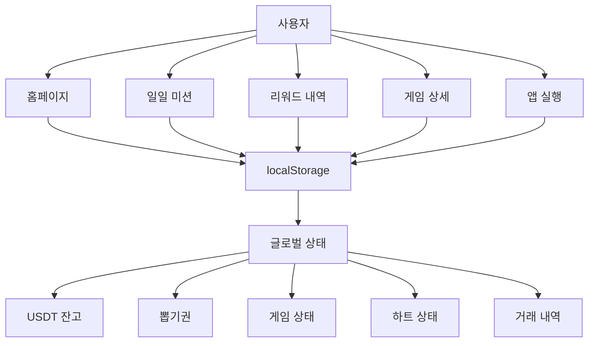
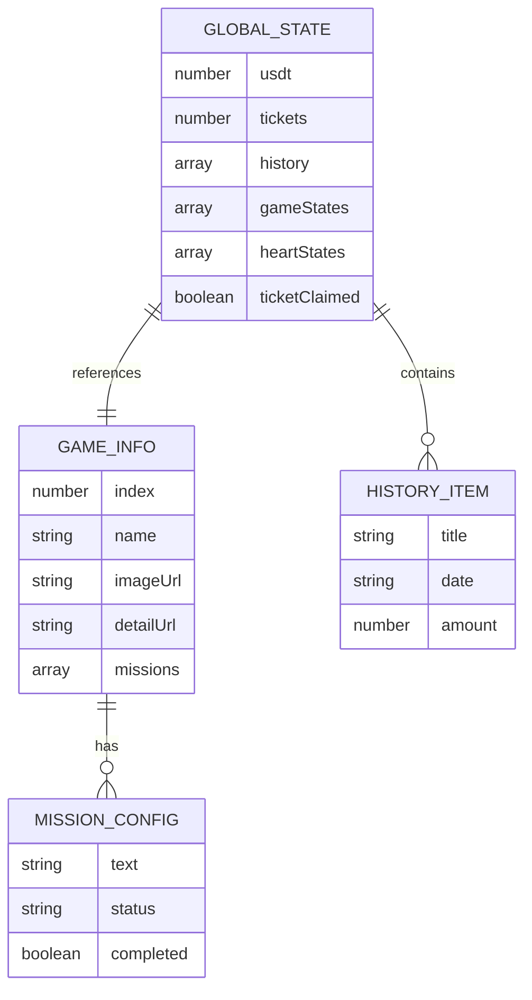
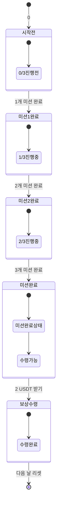
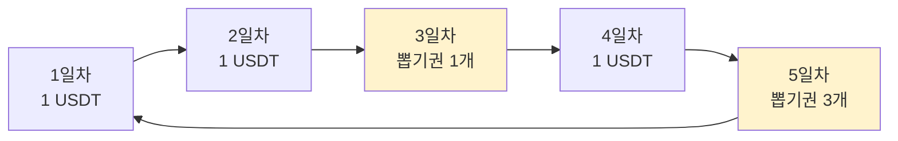
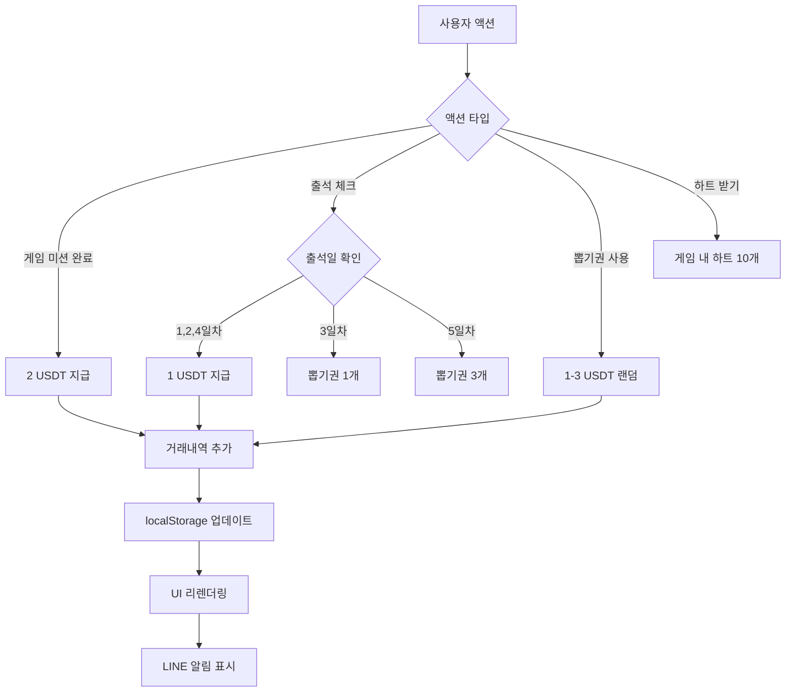
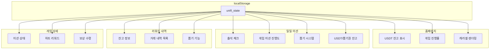
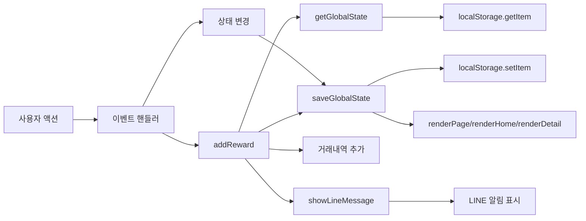
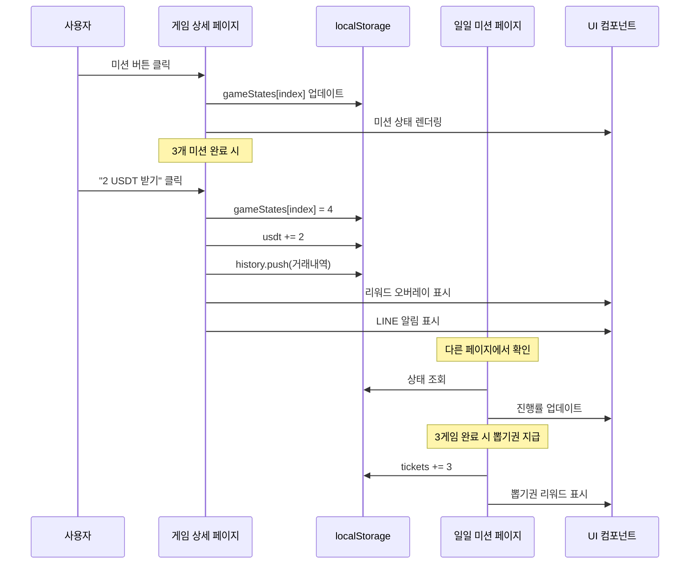

# 미션앤리워드 데이터 플로우 다이어그램

## 1. 전체 시스템 아키텍처

## 2. 데이터 구조 관계도

## 3. 게임 상태 전환 다이어그램

## 4. 출석 체크 시스템

## 5. 리워드 획득 플로우

## 6. 페이지별 데이터 의존성

## 7. 함수 호출 관계도

## 8. 게임 미션 완료 프로세스

이 다이어그램들을 통해 미션앤리워드 시스템의 데이터 흐름과 상호작용을 명확하게 이해할 수 있습니다.